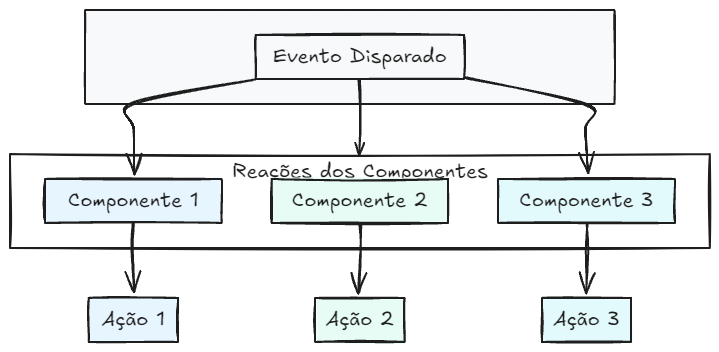
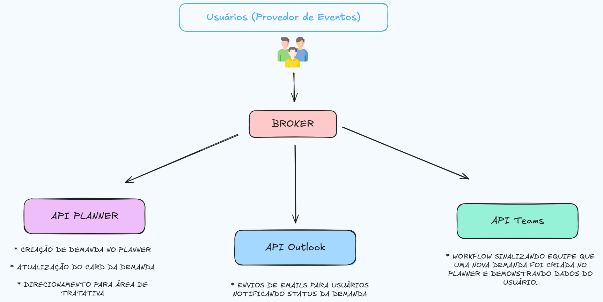

# Sistema de Gerenciamento das Demandas

## 🎯 1. Objetivos do Sistema 

Desenvolver uma aplicação que permita:

* **Automatizar o processo de registro e acompanhamento de demandas**: 

    * Reduzindo o trabalho manual e melhorando a rastreabilidade das solicitações.

* **Garantir a eficiência na gestão das tarefas**: 

    * Realizando a criação das demandas de forma automática no Plannen e mantendo a equipe informada sobre essas novas criações.

* **Melhorar a comunicação com os clientes e a equipe**:

    * Utilizando notificações interativas e personalizadas desenvolvidas em HTML, CSS, Java Script e JSON, conseguimos manter os stakeholders devidamente atualizados sobre os status das suas demandas.

* **Centralizar informações para rastreabilidade e análises**:

    * Armazenando todas as solicitações podemos utilizar para consultas e análises de desempenho e eficiência.

#

## ✅ 2. Benefícios 

- **Eficiência Operacional**: 
    * Redução do tempo gasto no registro e acompanhamento de demandas;

    * Automatização de tarefas repetitivas, evitando erros manuais;

- **Transparência e Rastreabilidade**:

    * Registro centralizado das demandas, permitindo obter um histórico e auditoria;

    * Fácil acompanhamento do status das solicitações em tempo real;

- **Melhoria na Comunicação**:

    * Notificações automáticas via email (personalizadas com HTML e CSS).

    * Feedback imediato para o usuário sobre a abertura e conclusão das demandas.

# 

## ⚙ 3. Ferramentas Utilizadas

A seguir estão as principais tecnologias, frameworks e bibliotecas utilizadas no desenvolvimento de sistema:

| Núcleo        | Tecnologia       |                                  
|------------------|----------------
| Back - end               | JSON, Python, SQL, APIs (via Power Automate) e Integration Service para ETL   
| Front - End            | HTML e CSS           
| Banco de Dados        | SQL Server               
| Versionamento     | Git e GitHub         
| Documentação   | Markdown

# 

## ✍🏼 4. System Design

### 4.1 Arquitetura do sistema

A arquitetura ideal para descrever o sistema é:

* **Arquitetura Orientada a Eventos:** 

    Uma arquitetura orientada a eventos é aquela em que as ações do sistema ocorrem como resposta a eventos específicos - em vez de rodarem continuamente ou sob comando manual. Desta forma, podemos determinar que um evento é tudo aquilo que acontece e que o sistema precisa reagir e a cada evento é disparado uma reação automática, geralmente através de triggers (gatilhos) e handlers (ações).

    

---

### 4.2 Diagrama do processo de funcionamento

* **Descrição Narrativa:**

    * **Requisição:** Usuário preeenche formulário e abre uma demanda

    * **Roteamento:** Um broker processa o evento e roteia o evento para as APIs externas para execução de ações necessários para dar continuidade na aplicação.

    * **Consumo de eventos:** As APIs reagem aos eventos recebidos, executando ações determinadas a elas para processar as informações.

    * **ETL e Consumo de Dados:** Criação de uma ETL via Integration Service, para importar os dados gerados para uma base presente em um banco SQL Server. Desta forma, o painel de monitoramento de demandas consome os dados dessa tabela.

     

#

## ✅ 5. Conclusão

O sistema de gerenciamento de demandas foi projetado com base em uma arquitetura orientada a eventos (Event-Driven Architecture), onde cada ação - desde a criação de uma nova solicitação até o envio de notificações e atualização de status - ocorre em respostas a eventos disparados automaticamente pelos usuários ou pelos próprios sistemas conectados.

Do ponto de vista arquitetural, o sistema apresenta:

* **Baixo acoplamento entre componentes**, permitindo evolução modular e adição de novos fluxos sem impacto no restante da solução.

* **Alta reatividade**, com execução em tempo quase real em resposta a eventos disparados.

Em síntese, o sistema consolida uma arquitetura inteligente e automatizada que unifica operações, comunicação e análise de dados dentro de um mesmo ecossistema.

